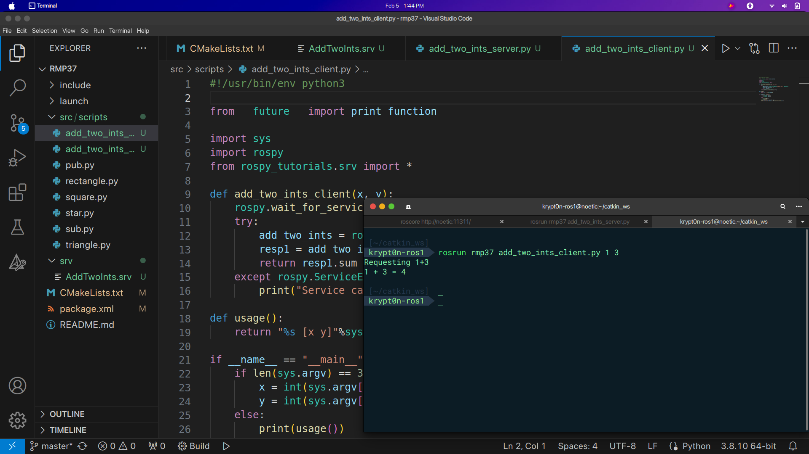
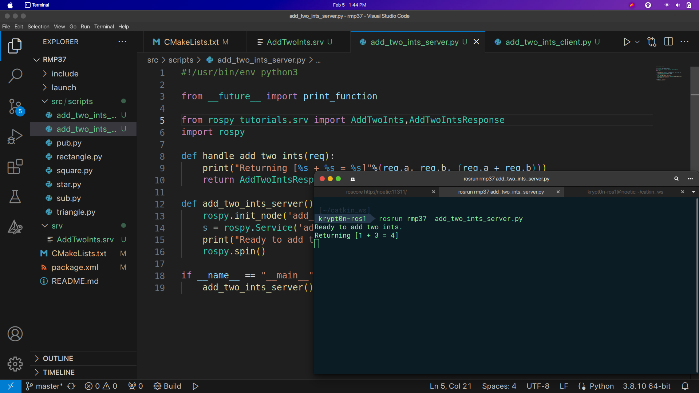

# Assignments completed during ROS Mentorship Program offered by RigBetel Labs.
## Session 1 : Python Programming - Calculator, Odd or Even Programs

## Session 2 : Custom Publisher and Subscriber Nodes Example - Youtuber and Subscriber.

## Session 3 : Launch File.

## Session 4 : Example of Image Processing using 3 nodes with Node 2 both publishing and subscribing at the same time.

## Session 5 : TurtleSim Exercise - Launch file with Turtlesim Nodes to draw shapes(Square, Rectangle, Triangle, Star shape) using TurleSim package.

## Session 6 & 7 : Services - Creating a service ("add_two_ints_server") node which will receive two ints from the Client ("add_two_ints_client") Node and return the sum.

